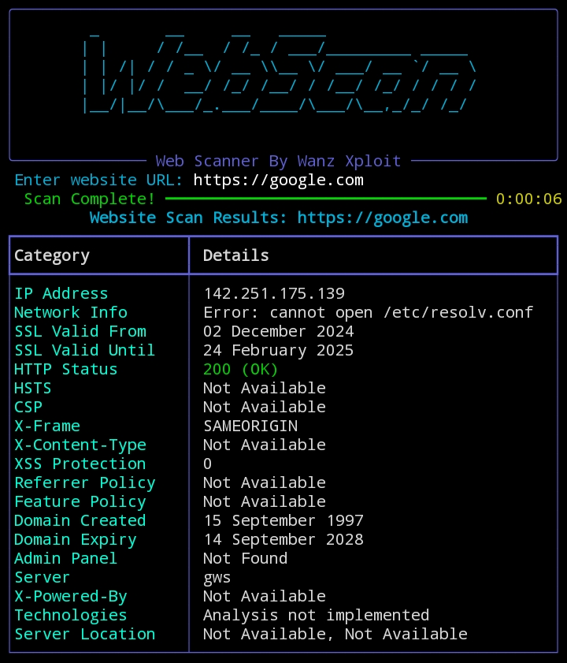

# WebScan




-brightgreen)


**WebScan** is a terminal-based tool that scans website URLs to retrieve critical information such as IP addresses, security status, vulnerabilities, and technical data. This tool is designed to assist security administrators and developers in auditing website security effortlessly.

---

## 🎯 Features
- Retrieve IP address information.
- SSL certificate status (validity and expiration dates).
- Key HTTP headers (CSP, X-Frame-Options, XSS Protection, etc.).
- Domain information (creation and expiration dates).
- Server technology detection.
- Easy-to-use terminal interface.
- Clean output using `rich` library.

---

## 🚀 Installation

Follow the steps below to install **WebScan** on Linux or Termux:

### **Using `Makefile` (Recommended):**
1. Clone the repository:
   ```bash
   git clone https://github.com/wanzxploit/WebScan.git
   cd WebScan
   ```
2. Run the command:
   ```bash
   make install
   ```

### **Without `Makefile`:**
1. Clone the repository:
   ```bash
   git clone https://github.com/wanzxploit/WebScan.git
   cd WebScan
   ```
2. Run the installation script:
   ```bash
   bash install.sh
   ```

---

## 🔧 Usage
After installation, use the following command to run the tool:

```bash
make run
```

Or, if not using `Makefile`:

```bash
python3 main.py
```

Enter the website URL when prompted, and the tool will process the information automatically.

---

## 🛠 Dependencies
WebScan requires several Python libraries, which are automatically installed during setup:
- `requests`
- `rich`
- `ssl`
- `socket`

---

## 📂 Directory Structure
```
WebScan/
├── main.py         # Main tool file
├── install.sh      # Automatic installation script
├── Makefile        # Automates installation and execution
├── README.md       # Tool documentation
└── ... (other files)
```

---

## ⚠️ Disclaimer
- **WebScan** is intended for legal use and security testing on your own assets. Do not use it for illegal purposes or unauthorized website scanning.
- Ensure you have a stable internet connection for optimal results.

---

## 🧑‍💻 Developed by
- **Name**: Wanz Xploit
- **GitHub**: [wanzxploit](https://github.com/wanzxploit)

---
